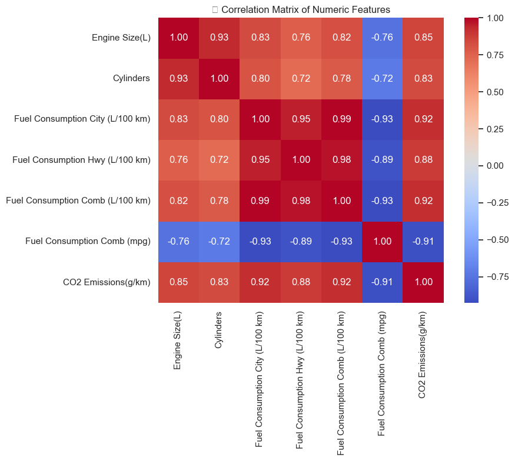
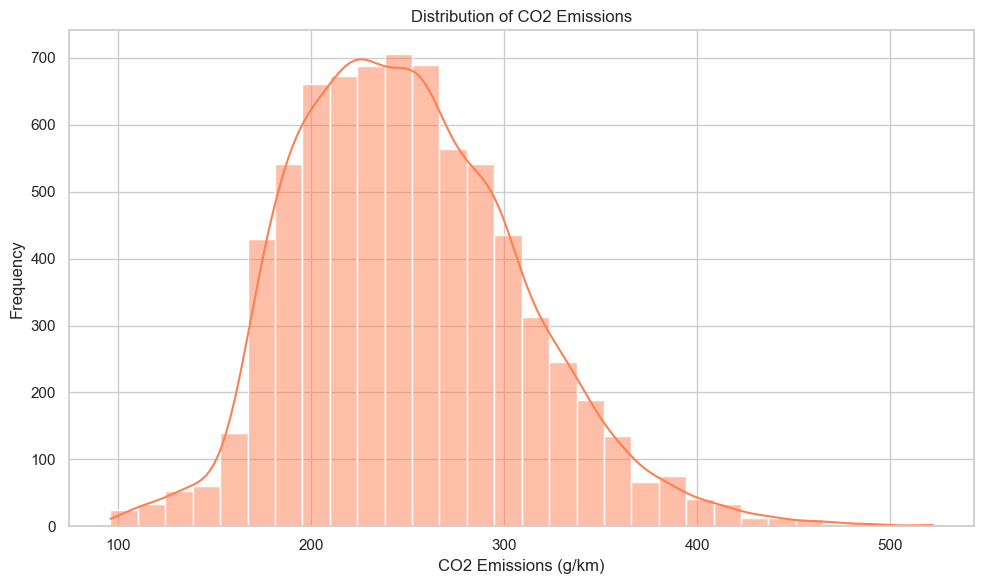
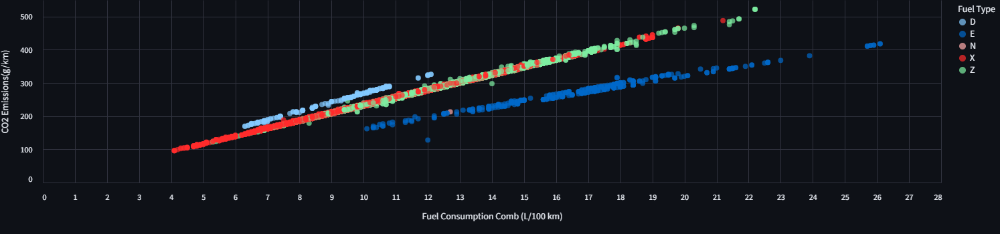
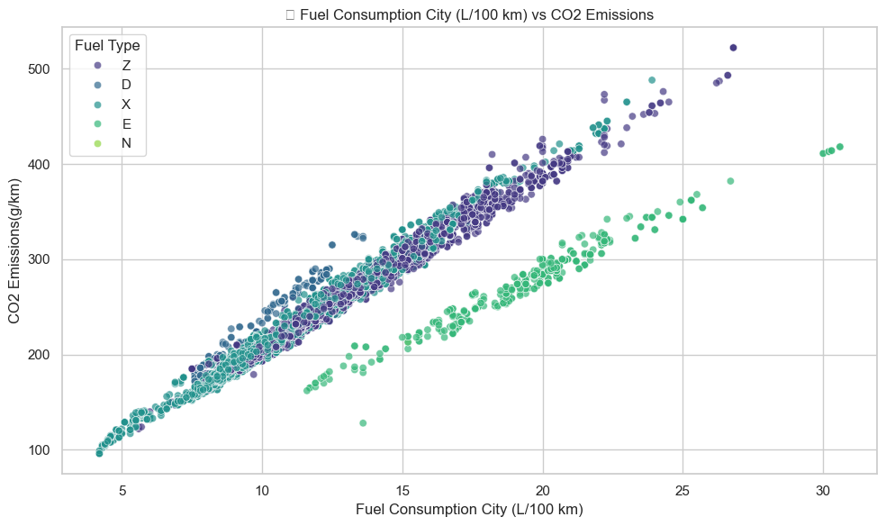
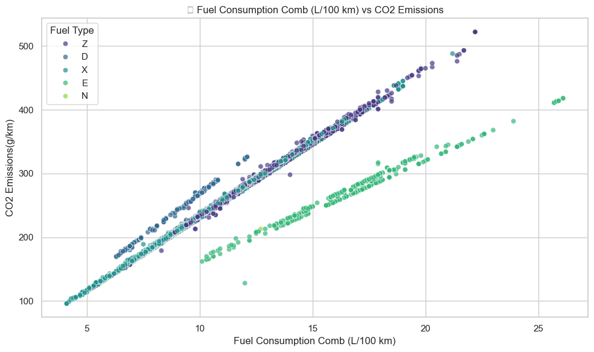
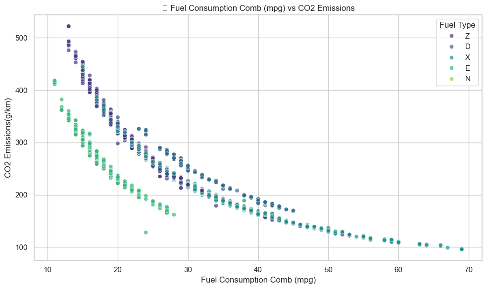
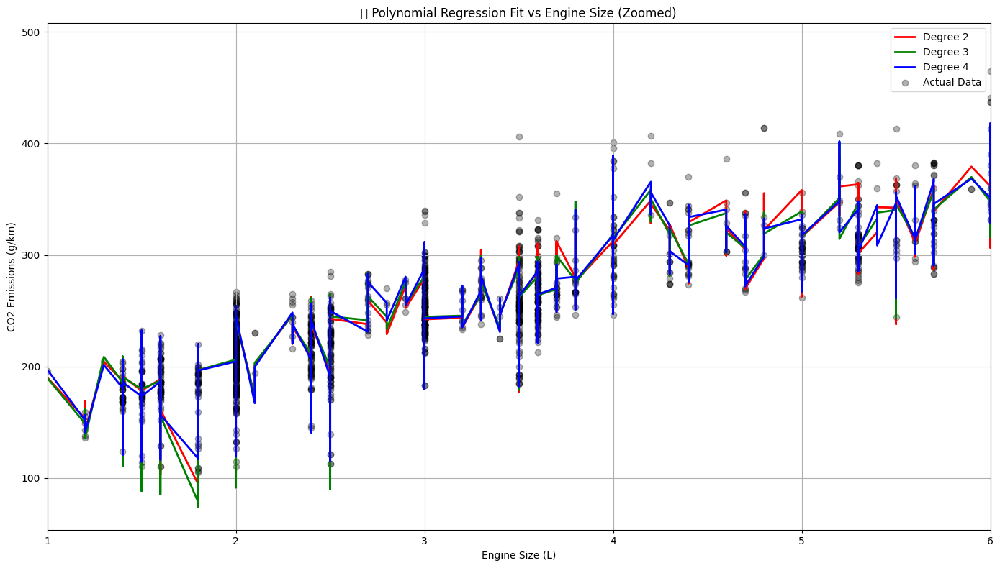

# 🚗 CO₂ Emissions Regression App

Predict CO₂ emissions (g/km) from car specifications using machine learning models such as Polynomial and Spline Regression. This project demonstrates a complete ML pipeline: from EDA and model training to deployment using Streamlit.

---

## 📌 Project Overview

With increasing climate concerns and environmental regulations, vehicle emissions are a key metric. Using a Canadian vehicle emissions dataset, this project aims to:

- Analyze how engine specs and fuel consumption relate to CO₂ emissions
- Compare Polynomial and Spline regression models
- Build an interactive web app to predict emissions
- Visualize key trends for better understanding and decision-making

---

## 👨‍💻 Author

> Developed by **Tamaghna Nag**  
> 📍 London, UK | Kolkata, India  
> 🌐 [https://tamaghnatech.in](https://tamaghnatech.in)  
> 📧 tamaghnanag04@gmail.com  
> 🔗 [LinkedIn](https://www.linkedin.com/in/tamaghna99/) | [GitHub](https://github.com/Tamaghnatech)

---

## 🧠 Dataset Features

The original dataset contains information about:

- Engine Size (L)
- Number of Cylinders
- Fuel Consumption (City, Hwy, Comb)
- Fuel Type (D, E, X, Z, N)
- CO₂ Emissions (g/km)
- Fuel Consumption (mpg)

---

## 🔎 Exploratory Data Analysis

### 🔥 Correlation Matrix of Features

Understanding relationships between numeric features.

---

### 📊 Distribution of CO₂ Emissions

The target variable shows a right-skewed distribution.

---

### 🧯 Fuel Consumption vs CO₂ Emissions (By Fuel Type)

Using dark mode plot to show relationships across fuel types.

---

### ⛽ Fuel Consumption vs CO₂ Emissions

- Fuel City vs CO₂  
  

- Fuel Comb (L/100 km) vs CO₂  
  

- Fuel Comb (mpg) vs CO₂  
  

---

## 🧪 Model Training

Two models were tested and evaluated:

- **Polynomial Regression (degree=4)**
- **Spline Regression**

We used RMSE, MAE, and R² score for performance comparison.

---

### 📈 Model Comparison

Polynomial model outperformed Spline in all metrics.

---

### 🔍 Polynomial Regression Fit (Zoomed View)

Fit comparison for degree 2, 3, and 4 polynomials.

---

## 🛠️ Tech Stack

- **Language:** Python
- **Framework:** Streamlit
- **ML Libraries:** scikit-learn, pandas, numpy
- **Visualization:** seaborn, matplotlib, altair
- **Experiment Tracking:** Weights & Biases (wandb)
- **Deployment (Planned):** Streamlit Community Cloud / Docker

---

## 💻 Project Structure

